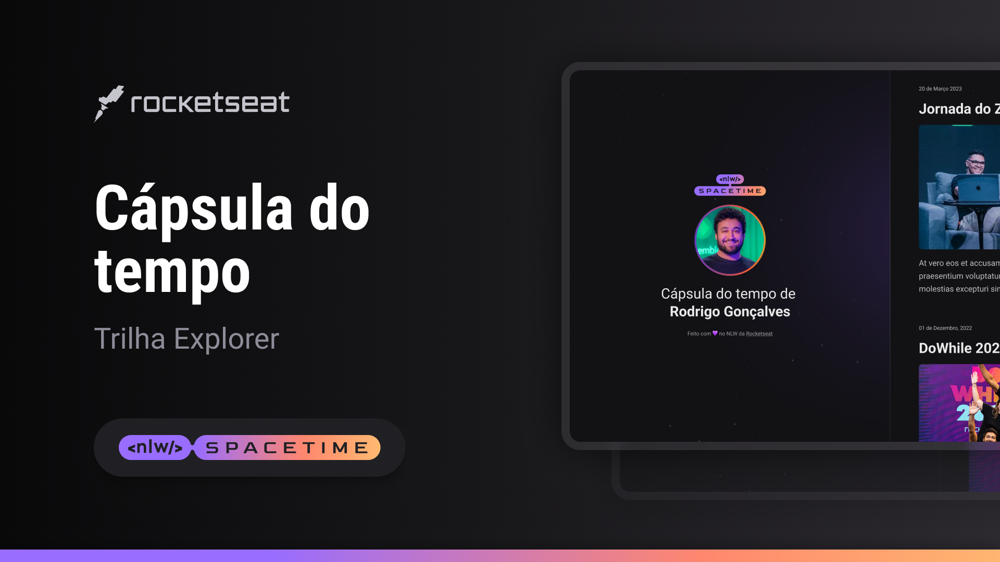

  

## 🖥️ projeto
Esse e um Projeto Responsivo de uma Capsula Do Tempo Para Exibir Memorias Em uma Linha Do Tempo

## 🚀tecnologias 
-HTML

-CSS

-Git,GITHUB

## 🏷️layout
Voce Pode Visualizar o Layout Atráves 
[Desse link](https://www.figma.com/file/pImPCGjogXRDXJhmk2RuEi/C%C3%A1psula-do-tempo-%E2%80%A2-Trilha-Explorer-(Community)?type=design&node-id=0%3A1&t=54wkq9ulUj00SEo4-1)
e nessesario ter uma conta no [Figma](https://www.figma.com)